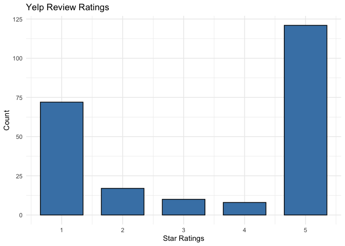
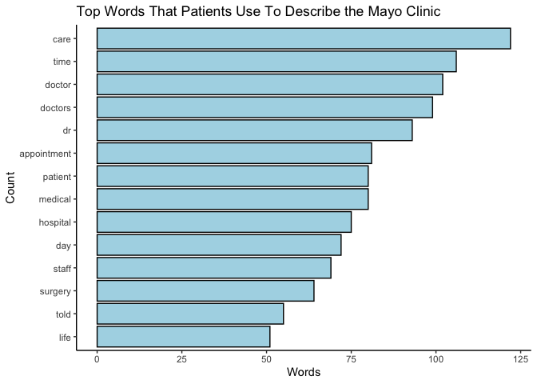
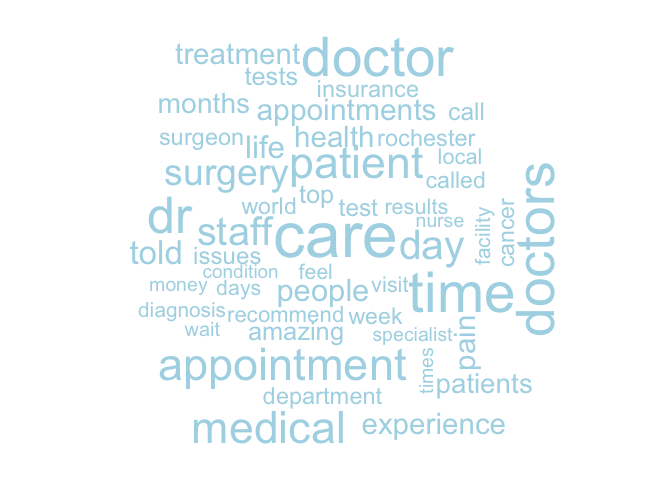
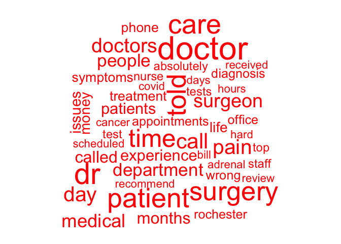
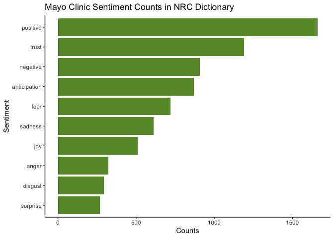
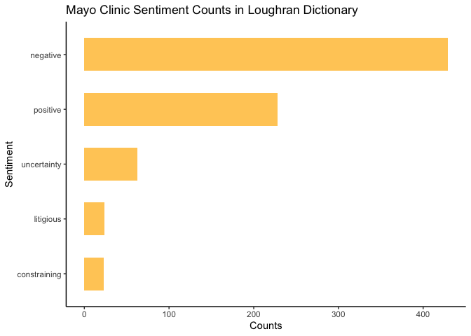

Mayo Clinic Yelp Review Text Analysis
================
RexManglicmot

- [Status: Continuing Working
  Document](#status-continuing-working-document)
- [Introduction](#introduction)
- [Webscraping Yelp Data](#webscraping-yelp-data)
- [Loading the Libraries](#loading-the-libraries)
- [Loading the Data](#loading-the-data)
- [Cleaning the Data](#cleaning-the-data)
- [Exploratory Data Analysis](#exploratory-data-analysis)
- [WordClouds](#wordclouds)
- [Sentiment: Positive and Negative
  Words](#sentiment-positive-and-negative-words)
  - [Appplications](#appplications)
  - [Pros](#pros)
  - [Cons](#cons)
- [Limitations](#limitations)
- [Conclusions](#conclusions)
- [Appendix](#appendix)
- [Inspiration for this project](#inspiration-for-this-project)

## Status: Continuing Working Document

Hi everyone. I’m continuing building my data analysis and R skills. As
such, I would love feedback to better improve this project via
<rexmanglicmot@gmail.com>. Any mistakes and misrepresentation of the
data are my own. Thank you!

Things Need to Do/Questions:

- Import and adjust dictionaries + describe and cite them.
- Fix overall grammar
- Need to List of the metrics in US News for evaluating hospitals and
  pick up where they left off or, pick up on what is missing in their
  analyses.
- Need to find code to align left on the text column in the cleaning
  section
- Learn how to create a US heat map code in the EDA section
- look for a dictionary that has Male and Female first names and run it
  against data to see how many of each gender is present in the reviews
- look for code how to highlight certain columns in a barchart (i.e.,
  ratings barchart below)
- Create and cite sources of the benefits of wordclouds
- Properly center the US News pic on git_document (somehow works fine in
  RStudio html document?)
- Add more dictionaries

## Introduction

<p align="center">

</p>

What is the best hospital in the United States? Which one is closest to
me? What do real patients have to say about a particular hospital? These
are just a few of the many questions Americans face as they navigate the
complex U.S. healthcare system.

In 2022, average healthcare spending per person in the U.S. reached
\$12,530—up from \$11,462 in 2019.[^1] With 6,093 hospitals operating
across the country,[^2] choosing where to receive care is both a
personal and financial decision. Unlike single-payer systems in
countries like Canada, the United Kingdom, or Australia, the U.S.
healthcare system is a mix of private, public, and nonprofit
institutions. Consequently, not all hospitals are created equal—some are
well-resourced and highly regarded, while others struggle with quality
and access.

To help guide patients, U.S. News & World Report publishes an annual
ranking of the best hospitals in the United States.[^3] While the list
evaluates about 4,500 facilities, it does not include every hospital in
the country. For the 2022–23 rankings, the Mayo Clinic in Rochester,
Minnesota, was named the \#1 hospital.

To gain further insight into what makes the Mayo Clinic exceptional—and
to complement traditional clinical and administrative metrics—this
project applies a text analysis approach to patient reviews on Yelp.
Yelp is a widely used platform for reviewing businesses, including
healthcare institutions, and offers a unique window into the lived
experiences of patients.

Objectives This project has three main goals:

Identify recurring word patterns and themes that reflect authentic
patient sentiment in a reproducible way.

Provide actionable insights for hospital administrators to better
understand the patient experience.

Offer benchmarks for lower-ranked hospitals to reflect on how
patient-centered services might be improved.

To address these objectives, this report applies a suite of text mining
methods to analyze unstructured Yelp reviews of the Mayo Clinic.

Report Structure: This project is organized into the following
sections: 1. Webscraping Yelp Data 2. Loading the Libraries 3. Loading
the Data 4. Cleaning the Data 5. Exploratory Data Analysis 6. Column
Charts and WordClouds 7. Sentiment: Positive and Negative Words 8.
Limitations 9. Conclusion 10. Appendix 11. Inspiration for This Project

## Webscraping Yelp Data

Yelp data was scrapped on via the [Yelp](https://www.yelp.com/) website.
Within the search engine bar, I typed in *Mayo Clinic* and used the
first “business result to scrape the data as it’s location, Rochester
Minnesota matched on US News. Further, the business had
a”blue-checkmark” with “Claimed” indicating that the business was the
legitimate Mayo Clinic.

There were 228 reviews in total and the goal was to scrape all 228
reviews containing these 4 metrics:

1.  reviewer name
2.  reviewer location
3.  review rating
4.  review text

(Photos were excluded from scraping due to the focus on text-based
analysis.)

After several hours of debugging and inspecting HTML tags, I
successfully extracted all 228 reviews. One key challenge was avoiding
the inclusion of business replies, such as official Mayo Clinic
responses, which could have inflated the review count. Adjusting the
scraping logic helped prevent this.

A special acknowledgement to Samer Jijjazi for his YouTube tutorial in
learning how to scrape data from Yelp.[^4]. Watching his videos greatly
helped me get the data needed to webscrape.

The code used for scraping is included below. The resulting dataset
(Mayo_Clinic.csv) is also available in this repository.

``` r
#load libraries
library(tidyverse)
library(rvest)

#create an object to store the webpage address
url <- 'https://www.yelp.com/biz/mayo-clinic-rochester-12?osq=Mayo+clinic'

#convert the url to an html object for R processing
webpage <- read_html(url)

#create object to know page number on the webpage
webpageNum <- webpage %>%
  html_elements(xpath = "//div[@class= ' border-color--default__09f24__NPAKY text-align--center__09f24__fYBGO']") %>%
  html_text() %>%
  str_extract('of.*') %>%
  str_remove('of ') %>%
  as.numeric()

#create a sequence to iterate for page number
webpageSeq <- seq(from = 0, to = (webpageNum * 10)-10, by = 10)

#store items into empty objects
reviewer_name_all = c()
reviewer_location_all = c()
review_rating_all = c()
review_text_all = c()

#create a for loop to get values throughout the 23 pages
for (i in webpageSeq) {
  #need to create an if statement because the 1st page web address
  if (i == 0) {
    webpage <- read_html(url)
    #need to create else because webpage has more content than 1st page web 
    #address
  } else {
    webpage <- read_html(paste0(url, '&start=', i))
  }
  
  #reviewer name
  reviewer_name <- webpage %>%
    #return elements that I specify via xpath method
    #xpath is useful for locating elements
    #// means to search within entire document
    #* means to return any of the elements
    # div means to search within document with the div tags
    html_elements(xpath = "//div[starts-with(@class,' user-passport')]") %>%
    #look within a tag within the previous element
    html_elements(xpath = ".//a[starts-with(@href, '/user_details')]") %>%
    html_text()
  
  #reviewer location
  reviewer_location <- webpage %>%
    #location is within the same div tag, so use same code
    html_elements(xpath = "//div[starts-with(@class,' user-passport')]") %>%
    #location is also located within the span tag
    html_elements(xpath = ".//span[@class= ' css-qgunke']") %>%
    html_text() %>%
    #remove "Location" 
    #pipe remaining values that are not "Location"
    .[. !='Location']
  
  #review rating
  review_rating <- webpage %>%
    html_elements(xpath = "//div[starts-with(@class, ' review')]") %>%
    #within div tag there is an aria-label
    #contains function to look for aria-label that has rating  
    html_elements(xpath = "(.//div[contains(@aria-label, 'star rating')])[1]")%>%
    #ratings are not text, so must use different method and specify which 
    #attribute to obtain
    html_attr('aria-label') %>%
    #remove star rating
    str_remove_all(' star rating') %>%
    #convert into a numeric
    as.numeric()
  
  #review text
  review_text <- webpage %>%
    html_elements(xpath = "//div[starts-with(@class, ' review')]") %>%
    #look throughout webpage with the p tag
    #to get the first comment and not worr about business comment,
    #need to put in brackets
    html_elements(xpath = "(.//p[starts-with(@class, 'comment')])[1]") %>%
    #html_elements(xpath = ".//span[starts-with(@class, ' raw')]") %>%
    html_text()
  
  #appending to appropriate objects
  reviewer_name_all = append(reviewer_name_all, reviewer_name)
  reviewer_location_all = append(reviewer_location_all, reviewer_location)
  review_rating_all = append(review_rating_all, review_rating)
  review_text_all = append(review_text_all, review_text)
  
}

#create a dataframe containing appended values
Mayo_Clinic <- data.frame('name' = reviewer_name_all,
                          'location' = reviewer_location_all,
                          'rating' = review_rating_all,
                          'text'= review_text_all)

#view csv file
#head(Mayo_Clinic)
```

## Loading the Libraries

``` r
#load libraries
#install.packages('tidyverse') #had to re-install for some reason on 11/12/22
#install.packages('ggraph') #had to re-install for some reason on 11/12/22
#install.packages('DT')
#install.packages('gt')

library(tidyverse)
library(tidytext)
library(widyr)
library(RColorBrewer)
library(wordcloud)
library(igraph)
library(ggraph)
library(gt)
library(dplyr)
```

## Loading the Data

``` r
#load Mayo Clinic data
data <- read.csv('Mayo_Clinic.csv')
```

## Cleaning the Data

Since the dataset has been successfully loaded, we’ll begin by exploring
its structure. Instead of using the basic str() function, I’ll expand my
R skills by applying other functions to examine the variable names and
dimensions of the dataset.

``` r
#get the names of the variables
colnames(data)
```

    ## [1] "X"        "name"     "location" "rating"   "text"

``` r
#get the number of rows in the dataset
dim(data)
```

    ## [1] 228   5

From the output, we can see that there is an extra column named X, which
is simply an index column generated when the CSV file was saved. This
column is not needed for our analysis, so we’ll remove it.

``` r
#remove the X column
data <- data %>%
  select(-X)

#get the names other than the colnames funciton
names(data)
```

    ## [1] "name"     "location" "rating"   "text"

``` r
dim(data)
```

    ## [1] 228   4

Now that the X column has been removed, we can confirm that the dataset
contains only the relevant columns: reviewer name, location, rating, and
review text.

``` r
#View first rows of the observations of the data
head(data)
```

    ##         name          location rating
    ## 1  Stacey C.  Indianapolis, IN      5
    ## 2    Arin W.       Chicago, IL      1
    ## 3 Jessica S.   Kansas City, MO      5
    ## 4    Fran H. San Francisco, CA      1
    ## 5   Annie R.        Denver, CO      1
    ## 6    Bess L.  Laguna Beach, CA      1
    ##                                                                                                                                                                                                                                                                                                                                                                                                                                                                                                                                                                                                                                                                                                                                                                                                                                                                                                                                                                                                                                                                                                                                                                                                                                                                                                                                                                                                                                                                                                                                                                                                                                                                                                                                                                                                                                                                                                                                                                                                                                                                                                                                                                                                                                                                                                                                                                                                                                                                                                                                                                                                                                                                                                                                                                                                                                                                                                                                                                                                                                                                                                                                                                                                                                                                                                                                                                                                                                                                                                                                                                                                                                                                                                                                                                                                                                                                                                                                                                                                                             text
    ## 1                                                                                                                                                                                                                                                                                                                                                                                                                                                                                                                                                                                                                                                                                                                                                                                                                                                                                                                                                                                                                                                                                                                                                                                                                                                                                                                                                                                                                                                                                                                                                                                                                                                                                                                                                                                                                                                                                                                                                                                                                                                                                                                                                                                                                                                                                                                                                                                                                                                                                                                                                                                                                                                                                                                                                                                                                                                                                                                                                                                                                                                                                                                                                                                                                                                                                                                                                                 I only have good things to say about Mayo.  A family member was diagnosed by their  local doctor with a condition that required surgery to correct.  Several local doctors preform this surgery occasionally buy not routinely so we contacted Mayo where they have a specialist who focuses on this procedure and does over 300 a year.  We transmitted the records and tests electronically, had phone consultations, scheduled a week long visit.  All of the staff was professional, engaging, and seemed to honestly care about their job and the patients.  The cross coordination, communication, and care are so different than typically health care.
    ## 2                                                                                                                                                                                                                                                                                                                                                                                                                                                                                                                                                                                                                                                                                                                                                                                                                                                                                                                                                                                                                                                                                                                                                                                                                                                                                                                                                                                                                                                                                                                                                                                                                                                                                                                                                                                                                                                                                                                                                                                                                                                                                                                                                                                                                                                                                                                                                                                                                                                                                                                                                                                                                                                                                                                                                                                                                                                                                                                                                                                                                                                                                                                                                                                                                                                                                   The clinic might be great. I'll never know because they rejected me via form email that told me to "keep perusing local options" after making me jump through many hoops and having me sign upfor the patient portal which I now have no use for.  Also the person on the phone kept interrupting me and flatly saying "I need something that I can put in as a code".Both the phone calls I had were unsympathetic and frankly a waste. I'd bet money no actual person looked at my paperwork. Just a machine that scanned for keywords. It gets worse. My parents got in easy breezy for Executive Physicals which are extensive but only available to executives and their spouses. Which makes zero sense. (Hint: the answer is elitism)
    ## 3                                                                                                                                                                                                                                                                                                                                                                                                                                                                                                                                                                                                                                                                                                                                                                                                                                                                                                                                                                                                                                                                                                                                                                                                                                                                                                                                                                                                                                                                                                                                                                                                                                                                                                                                                                                                                                                                                                                                                                                                                                                                                                                                                                                                                                                                                                                                                                                                                                                                                                                                                                                                                                                                                                                                                                                                                                                                                                                                                                                                                                                                                                                                                                                                                                                                                                                                                                                                                                                                                                                                                                                                                                                                                                                                                                                                                                                It's hard to put into words the size of this place. Amazing medical center with top notch doctors, nurses, and all the support staff. A collaborative effort from all involved.
    ## 4                                                                                                                                                                                                                                                                                                                                                                                                                                                                                                                                                                                                                                                                                                                                                                                                                                                                                                                                                                                                                                                                                                                                                                                                                                                                                                                                                                                                                                                                                                                                                                                                                                                                                                                                                                                                                                                                                                                                                                                                                                                                                                                                                                                                                                                                                                                                                                                                                                                                                                                                                                                                                                                                                                                                                                                                                                                                                                                                                                                                                                                                                                                                                                                                                                                                                                                                                                                                                                                                                                                                                             Received a text saying I missed my appt with my provider. Problem is I haven't even been set up to see a provider. So I called and was not very happy with Missy in General Internal Medicine. A little kindness and an apology for the error, rather than insist it was a phone call from central that I failed to pick up, would have been sufficient. I asked why they didn't leave a VM? "Is there anything else you need?" was Missy's reply. Absolutely not.
    ## 5 I moved here for a surgery. I had a tumor on my adrenal gland, and they couldn't figure out what it was. These tumors are notoriously hard to diagnose. My endocrinologist, Dr. Naan, who is the head of the department, was disrespectful and didn't take my case seriously. The first time I saw her, we did nothing. As we were standing up to leave she tells me that 1/3 of tumors like mine are benign, and she says that like it's a good thing. I stopped and said that this means 2/3 are malignant, and she just says "yup" and continues walking out the door. I was in shock. I'm only 36 y.o., and I had been told previously that it was probably benign. I never thought a doctor, let alone a department head, would be that flippant about telling me I had a 2/3 chance of having cancer. Next session, I told her I was really stressed about that, and I had spent an hour w a friend talking about it. Dr Naan replied "uh oh, I hope you weren't drinking". So, apparently Mayo Clinic department heads think patients have to be drunk to be worried about having a 2/3 chance of cancer. She was beyond dehumanizing. My surgeon, Dr McKenzie, didn't do any education during our surgical consult pertaining to the surgical procedure, what I can expect to happen during surgery, or the risks of surgery. I wrote a review, that was supposed to be confidential, detailing the things he left out. The resident came to see me the day off the surgery and educated me on exactly the things I mentioned in my anonymous review, nothing more, nothing less. He didn't tell me I'd have a catheter placed inside me during the operation, and no one told me after either. I only found out bc I was urinating blood, and because of the pain. Neither my endocrinologist or surgeon made any plans to follow up with me after surgery to discuss what the mass is, and the surgeon wrote explicitly in his notes that a follow up visit was not needed....so no one had plans to follow up and tell me what the mass was. And they didn't. I had some questions that I messaged them, a resident called back to answer my questions, but he never mentioned what the mass was until I asked. Then he said he was going to bring it up. The tumor wasn't in the same place they thought it was, it was actually outside the adrenal gland, and the resident said the adrenal gland would have died anyway, if they had just resected the tumor and not the whole gland. However, the tumor was not even inside the adrenal gland. No one told me that either. I read it in a report, and I brought it up to the resident. The resident said the surgeon didn't bring it up because the surgeon could not differentiate between tumor and regular adrenal gland. This surgeon does many, many adrenal resections each year, he's regarded as highly skilled, and he's does do partial adrenalectomies...so how is it possible that this surgeon could not differentiate between normal adrenal gland and a tumor that's sitting outside but adjacent to the adrenal? The surgeon just didn't want to educate me on anything that a normal patient would want to know -surgery risks, surgery outcomes, etc. I really wanted just the tumor removed, and Dr Naan mentioned that she wasn't sure the tumor was inside the adrenal, but the surgeon never said anything about that. The resident said that no one could have known that the tumor was outside the gland. Between Dr Naan and Dr McKenzie, it's just more dehumanizing bs than I can take. This is hard enough, but add on doctors like them who obviously don't care about my case at all, and the process becomes exponentially worse. I cannot believe I moved out here, to try to get better care, and ended up with doctors like these two who have been so offensive and absent on my case. Choosing Mayo was a huge mistake, and I don't recommend them. Go somewhere else, anywhere else, where they treat people like humans.
    ## 6                                                                                                                                                                                                                                                                                                                                                                                                                                                                                                                                                                                                                                                                                                                                                                                                                                                                                                                                                                                                                                                                                                                                                                                                                                                                                                                                                                                                                                                                                                                                                                                                                                                                                                                                                                                                                                                                                                                                                                                                                                                                                                                                                                                                                                                                                                                                                                                                                                                                                                                                                                                                                                                                                                                                                                                                                                                                                                                                                                                                                                                                                                                                                                                                                                                                                                                                                                                                                                                                                                                                                                                                                                                                                                                         Seen by resident doctor  in emergency  room. As a retired  medical  professional the treatment  lacked  what I would expect from  a hospital which  claims  to be number 1 in the country.  I believe  that a person  treatment  wouldn't  be any different  at any teaching  hospital in the country.

``` r
#how many observations are in the text column
length(data$text)
```

    ## [1] 228

At first glance, we see that the text column appears empty for some
early observations, except for the fifth entry. However, the total
number of observations in the text column confirms that all 228 reviews
are present.

When viewing the data frame in RStudio, the text appears right-aligned
by default. This alignment is purely a visual artifact of how R prints
character vectors in console views and does not impact the content or
structure of the data itself.

Great, now let’s see if there are duplicates AND if there is more than
one reviewer in the dataset.

``` r
#check for duplicates
sum(duplicated(data))
```

    ## [1] 0

``` r
#quick check to see if reviewer_name appears more than once
data %>%
  count(name, sort = TRUE) %>%
  #let's arbitarailys see the first 10 rows as base comparison
  head(n=10)
```

    ##           name n
    ## 1  Courtney C. 2
    ## 2   Jessica D. 2
    ## 3      John M. 2
    ## 4  Michelle F. 2
    ## 5   Phillip H. 2
    ## 6         A S. 1
    ## 7     Aaron J. 1
    ## 8      Alan R. 1
    ## 9  Aleyysha A. 1
    ## 10  Alfonso E. 1

The results show that there are no duplicate rows in the dataset.
However, five reviewers submitted two reviews each, meaning 5
individuals account for 10 reviews. This brings the count of unique
reviewers to 223 out of the 228 total reviews.

This step confirms that while the dataset is nearly one-to-one between
reviewer and review, there are a few repeat reviewers worth noting.

In cleaning our data, let’s see if there are any NA values and which
columns.

``` r
#if any NA, then where in the dataset
which(is.na(data))
```

    ## integer(0)

``` r
#quick check to see and sum if any NA are in rating variable
sum(is.na(data))
```

    ## [1] 0

The output confirms that there are no missing values (NA) in the
dataset. All rows across all columns—reviewer name, location, rating,
and text—are complete and ready for analysis.

As a final check before beginning analysis, we verify that all values in
the rating column fall within the expected range of 1 to 5. We also
ensure there are no unexpected characters or text entries in the column.

``` r
#quick check to see if below 1 OR above 5
any(data$rating > 5 | data$rating <1)
```

    ## [1] FALSE

``` r
#create functions
numbers_only <- function(x) !grepl("\\D", x)
letters_only <- function(x) !grepl("[^A-Za-z]", x)

#let's double check the ratings column
sum(numbers_only(data$rating))
```

    ## [1] 228

``` r
sum(letters_only(data$rating))
```

    ## [1] 0

The results confirm that 1) No ratings are outside the 1–5 range 2) All
228 entries are numeric and 3) There are no alphabetic or invalid
characters in the rating column.

Now that the dataset has been thoroughly validated and cleaned, we’re
ready to begin exploring the data.

## Exploratory Data Analysis

To begin exploring the dataset, we first examine the distribution of
patient ratings using summary statistics.

``` r
#calculate summary statistics
summary(data$rating)
```

    ##    Min. 1st Qu.  Median    Mean 3rd Qu.    Max. 
    ##    1.00    1.00    5.00    3.39    5.00    5.00

From the output, we observe that the median and maximum rating are both
5, while the mean is approximately 3.39. This suggests that a large
number of patients gave Mayo Clinic the highest rating, indicating a
positively skewed distribution.

The best way to visualize this pattern is with a bar chart, which we’ll
generate in the next step.

``` r
#create a barchart to count the values
ggplot(data, aes(x=rating)) +
  geom_bar(color='black', fill='steelblue', width = .7) +
  scale_fill_brewer(palette="Dark2") +
  theme_minimal() +
  labs(title = 'Yelp Review Ratings',
        x = 'Star Ratings',
        y = 'Count')
```

<!-- -->

The bar chart clearly shows a polarized distribution in Yelp reviews for
the Mayo Clinic. The majority of reviews are either 1-star or 5-star,
with significantly fewer reviews in the middle categories (2, 3, and 4
stars).

This pattern suggests that patient experiences tend to be highly
positive or highly negative, rather than moderate. These extremes in
sentiment indicate that reviewers may be motivated to leave feedback
only when their experiences are particularly memorable—either very good
or very poor.

Let’s get the actual values of these counts by building a table.

``` r
#create dataframe to build stacked barchart
rating <- c(1,2,3,4,5)
total <- c((sum(data$rating == 1)),
           (sum(data$rating == 2)),
          (sum(data$rating == 3)),
          (sum(data$rating == 4)),
          (sum(data$rating == 5)))

#create a table of all the rating sums
table3 <-data.frame(rating, total)
print(table3)
```

    ##   rating total
    ## 1      1    72
    ## 2      2    17
    ## 3      3    10
    ## 4      4     8
    ## 5      5   121

From the table above, we see that 1) 72 reviews gave a rating of 1 star
and 2) 121 reviews gave a rating of 5 stars. Together, those two
categories account for nearly 85% of all reviews. This reinforces the
earlier insight that most patients rated their experience at the Mayo
Clinic as either very positive or very negative, with relatively few
moderate experiences in between.

WORK ON!!!! START What we can do for the next steps are to separate the
228 reviews into 3 sections; 1 rating, 5 rating, and overall rating and
see what words are associated within each. That would be interesting to
figure out. STOP

## WordClouds

In this project, wordclouds will be used to illustrate common words
patients use when reviewing the Mayo Clinic. These visualizations help
surface emotionally charged, repeated, or thematically important words
without requiring the reader to sift through hundreds of individual
reviews. Wordclouds emphasize the most frequently used words in a body
of text by enlarging them proportionally to their frequency, making them
ideal for quickly identifying key themes or repeated language.

In order to create a wordcloud, we need to break each review into
individual words and represent each word as a separate observation. This
transformation allows us to count word frequency across all reviews. As
a result, the total number of observations will increase significantly
from the original 228 rows.

This process is known as tokenization—splitting sentences into their
component words. To begin, we remove unnecessary columns (name,
location, and rating) and store the cleaned text data in a new object,
data2. We also verify that the text column is a character type before
proceeding.

``` r
#Tokenize data

#drop irrelevant columns by indexing 
data2 <- data[-c(1:3)] 

#let's double check the str to see it is a character 
is.character(data2$text)
```

    ## [1] TRUE

Output \[1\] TRUE confirms that the column is suitable for tokenization.

Now let’s break up the sentences into individual words (tokenizing).

``` r
#tokenize data
data3<- data2 %>%
  #break up each sentence in the text and assign them an individual row
  unnest_tokens(word, text)

#count token data
data3%>%
  count(word) %>%
  #count with the highest tally of words on top of the list
  arrange(desc(n)) %>%
  head(n=10)
```

    ##    word    n
    ## 1   the 1454
    ## 2    to 1123
    ## 3   and 1115
    ## 4     i  939
    ## 5     a  784
    ## 6    of  551
    ## 7    in  456
    ## 8    my  454
    ## 9   was  449
    ## 10 they  431

Because the meaning of an English sentence is shaped by the combination
of its words, it’s important to identify and remove those that do not
contribute significant meaning—often referred to as “stop words” or
“filler words” (e.g., “the,” “a,” “an,” “of,” etc.). These words are
extremely common but do not help us understand the content or sentiment
of a review. To create a more informative and meaningful wordcloud,
we’ll clean the tokenized data by removing these stop words using a
predefined dictionary. We’ll perform this step using an anti-join and
save the cleaned data into a new object called data4.

``` r
#takeout stop words
data4 <- data2 %>%
  unnest_tokens(word, text) %>%
  anti_join(stop_words) #we have less words now, like 1/3 got erased
```

``` r
#count token data again without the stop words
data4 %>%
  count(word) %>%
  arrange(desc(n)) %>%
  head(n=10)
```

    ##           word   n
    ## 1         mayo 314
    ## 2       clinic 154
    ## 3         care 122
    ## 4         time 106
    ## 5       doctor 102
    ## 6      doctors  99
    ## 7           dr  93
    ## 8  appointment  81
    ## 9      medical  80
    ## 10     patient  80

We observe that the words “mayo” and “clinic” are the most frequently
used terms, ranking 1st and 2nd, respectively. To further refine our
analysis and generate a more insightful wordcloud, we should consider
adding these words to the stop word dictionary and removing them from
the dataset.

``` r
custom_stop_words <- tribble(
  ~word, ~lexicon,
  'mayo', 'CUSTOM',
  'clinic', 'CUSTOM',
)

stop_words2 <- stop_words %>%
  bind_rows(custom_stop_words)
```

Let’s see if that works

``` r
#takeout out custom words
data5 <- data4 %>%
  anti_join(stop_words2)
```

``` r
#count token data again without the stop words and arrange the 
data5 %>%
  count(word) %>%
  arrange(desc(n)) %>%
  head(n=15)
```

    ##           word   n
    ## 1         care 122
    ## 2         time 106
    ## 3       doctor 102
    ## 4      doctors  99
    ## 5           dr  93
    ## 6  appointment  81
    ## 7      medical  80
    ## 8      patient  80
    ## 9     hospital  75
    ## 10         day  72
    ## 11       staff  69
    ## 12     surgery  64
    ## 13        told  55
    ## 14        life  51
    ## 15      people  50

It worked. So, lets get rid of numbers in the list.

``` r
#not interested in numbers, need to filter out
data6 <- data5 %>%
  #include words that has at least one alphabetical charachter in each out
  filter(str_detect(word, '[:alpha:]')) 
```

Now let’s get arrange the by the number of the most frequent words and
get rid of words that occur **once**, **twice**, and **thrice** since we
are only interested in the most frequent words.

``` r
#count token data again without the numbers
data7 <- data6 %>%
  count(word) %>%
  arrange(desc(n)) %>%
  filter(n!= 1 & n!= 2 & n!=3)

dim(data7)
```

    ## [1] 659   2

``` r
str(data7)
```

    ## 'data.frame':    659 obs. of  2 variables:
    ##  $ word: chr  "care" "time" "doctor" "doctors" ...
    ##  $ n   : int  122 106 102 99 93 81 80 80 75 72 ...

After a series of preprocessing steps—including tokenization, removal of
stop words, filtering out non-alphabetic tokens, and excluding
infrequent terms—we arrive at a clean dataset consisting of 659 unique
words that appeared at least four times in the corpus. These remaining
words, such as “care,” “time,” and “doctor,” reflect the most meaningful
and frequently mentioned concepts in the reviews. This cleaned data
provides a more accurate linguistic representation of the core themes
discussed by patients, removing filler or non-informative content. With
this refined dataset, we are now well-positioned to generate insightful
visualizations, such as word clouds or bar charts, to better understand
the topics and concerns most commonly raised in relation to Mayo Clinic.

``` r
library(ggplot2)

#lets filter for top 50 words
data8 <- data7 %>%
  filter(n > 50) %>%
  #rearrange for ggplot 
  mutate(word2 = fct_reorder(word, n))

#plot the data
ggplot(data8, aes(x=word2, y= n)) +
  geom_col(fill = 'lightblue', color= 'black') + 
  coord_flip() +
  labs(title = "Top Words That Patients Use To Describe the Mayo Clinic ",
       x = 'Count',
       y = 'Words') +
  theme_classic()
```

<!-- -->

``` r
wordcloud(
  words = data7$word,
  freq = data7$n,
  max.words = 50,
  colors = 'lightblue'
)
```

<!-- -->

The wordcloud above shows the overall patient word count from the 228
reviews. Now let’s create two additional wordclouds for those who rated
Mayo Clinic 1 and 5 stars.

``` r
#take original data set and pipe
data_A <-data %>%
  # get rid of all the columns name and location
  select(-name, -location) %>%
  # get rid of ratings 2, 3, and 4
  subset(rating != 2 & rating !=3 & rating !=4) %>%
  arrange(rating)

#create object that contains only 1 and 5 ratings only
data_A1 <- data_A %>%
  subset(rating != 5)

data_A5 <- data_A %>%
  subset(rating != 1)

#follow tokenize process for 1 rating
data_A1T <- data_A1 %>%
  #get rid of the rating category as this is not important anymore
  select(-rating) %>%
  unnest_tokens(word, text) %>%
  anti_join(stop_words2) %>%
  filter(str_detect(word, '[:alpha:]')) %>%
  count(word) %>%
  arrange(desc(n)) %>%
    filter(n!= 1 & n!= 2 & n!=3)

#follow tokenize process for 5 rating
data_A5T <- data_A5 %>%
  #get rid of the rating category as this is not important anymore
  select(-rating) %>%
  unnest_tokens(word, text) %>%
  anti_join(stop_words2) %>%
  filter(str_detect(word, '[:alpha:]')) %>%
  count(word) %>%
  arrange(desc(n)) %>%
  filter(n!= 1 & n!= 2 & n!=3)
```

``` r
wordcloud(
  words = data_A1T$word,
  freq = data_A1T$n,
  max.words = 50,
  colors = 'red')
```

    ## Warning in wordcloud(words = data_A1T$word, freq = data_A1T$n, max.words = 50,
    ## : appointment could not be fit on page. It will not be plotted.

    ## Warning in wordcloud(words = data_A1T$word, freq = data_A1T$n, max.words = 50,
    ## : department could not be fit on page. It will not be plotted.

    ## Warning in wordcloud(words = data_A1T$word, freq = data_A1T$n, max.words = 50,
    ## : surgery could not be fit on page. It will not be plotted.

<!-- -->

``` r
  wordcloud(
  words = data_A5T$word,
  freq = data_A5T$n,
  max.words = 50,
  colors = 'orange')
```

<!-- -->

Interesting. There is not much of a big difference amongst the three
groups. There are two insights from this:

1.  Maybe further filtering of words should be the next steps or,
2.  Wordclouds are not the best medium to understand a patient views on
    a healthcare system.

Next, lets use sentiment dictionaries on our three groups; overall, 1
rating, and 5 rating.

## Sentiment: Positive and Negative Words

Sentiment Analysis (SA) is a method to evaluate written text or language
based on a dictionary. In other words, SA is used to extract meaning
from a text. SA provides the ability to understand an observation’s
(i.e., customer) experience regarding a topic. SA is used when there is
large volume of text and to create a generalization of such.

### Appplications

- Customer feedback. Understanding user review comments on a web
  platform (i.e., Twitter)
- Analyze survey responses
- Competitor research

### Pros

- Diminish the risk of bias from a person investigating comments. As
  such, it diminish personal perceptions of the data and takes away the
  person’s mood and other incalculable biases.
- Quick to implement.

### Cons

``` r
#install.packages('SentimentAnalysis') #installed on 12/12/22
# install.packages('textdata') #installed on 12/12/22

#load libraries
library(SentimentAnalysis)
library(textdata)

#use data6 as it is the most funnelled data
sentiment_data <- data6 %>%
  #used the nrc dictionary
  inner_join(get_sentiments('nrc'))
```

    ## Warning in inner_join(., get_sentiments("nrc")): Detected an unexpected many-to-many relationship between `x` and `y`.
    ## ℹ Row 4 of `x` matches multiple rows in `y`.
    ## ℹ Row 12130 of `y` matches multiple rows in `x`.
    ## ℹ If a many-to-many relationship is expected, set `relationship =
    ##   "many-to-many"` to silence this warning.

``` r
sentiment_data_nrc <- sentiment_data %>%
  count(sentiment) %>%
  mutate(sentiment2 = fct_reorder(sentiment, n))

ggplot(sentiment_data_nrc, aes(x= sentiment2, y=n)) +
  geom_col(fill = '#669933') +
  coord_flip() +
  theme_classic() +
  labs(title = 'Mayo Clinic Sentiment Counts in NRC Dictionary',
       x= 'Sentiment',
       y = 'Counts')
```

<!-- -->

Interesting.

Insights:

- Based on the NRC dictionary, majority of the patients expressed the
  sentiment “positive” in their reviews, which had the most counts,
  followed by trust.
- The following four sentiments thereafter, as a group, be categorized
  as ambiguous and negative.

Interesting. What does this tell us? There is a mix big of emotions from
patients. It’s best to try another dictionary. So, let’s try ‘Loughran’

``` r
#use data6 as it is the most funneled data
sentiment_data2 <- data6 %>%
  #used the nrc dictionary
  inner_join(get_sentiments('loughran'))

sentiment_data_loughran <- sentiment_data2 %>%
  count(sentiment) %>%
  mutate(sentiment2 = fct_reorder(sentiment, n))

ggplot(sentiment_data_loughran, aes(x= sentiment2, y=n)) +
  geom_col(fill = '#FFCC66', width = 0.6) +
  coord_flip() +
  theme_classic() +
  labs(title = 'Mayo Clinic Sentiment Counts in Loughran Dictionary',
       x= 'Sentiment',
       y = 'Counts')
```

<!-- -->

Even more interesting.

Insights:

- Using this dictionary, we see that many of the reviews a categorized
  as negative.
- There is a 2x count of negative vs positive reviews.
- Uncertainty, litigious, constraining categories could further be
  included as negative.

## Limitations

Depending on the dictionary, there could be a diverse set of insights
from patients reviews. Using only two dictionaries, we see that the
reviews can easily be interpreted in different ways. Thus, sentiment
analysis although a good tool to understand patient perceptions are not
alone should be a sole tool to understand.

## Conclusions

## Appendix

## Inspiration for this project

Having worked at a non-profit hospital for six years made me realize the
importance of healthcare providers, patients, and the entire health
ecosystem. I wanted to see how my hospital ranked among others. Needless
to say, we did not make the rankings. That realization did spark an
interest to see what metrics did the top hospitals had over others. I
wanted to take a different approach and use patients reviews as a
metric.

Using patient reviews provides an unadultered way to understand
patients’ perspectives.

[^1]: <https://www.chcf.org/publication/2022-edition-health-care-costs-101/>

[^2]: <https://www.aha.org/statistics/fast-facts-us-hospitals>

[^3]: <https://health.usnews.com/health-care/best-hospitals/articles/faq-how-and-why-we-rank-and-rate-hospitals>

[^4]: <https://www.youtube.com/watch?v=qyGYItbMKkM>
